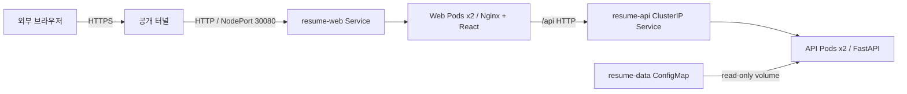

# 설계와 요구사항 매핑

## 계획된 물리 구성 — 실제 구축 시 IP·버전 기입

```text
Windows PC / VMware Workstation
  └─ VMware NAT network
      ├─ k8s-cp01        control plane + etcd
      ├─ k8s-worker01    Web / API Pod (분산 선호)
      └─ k8s-worker02    Web / API Pod (분산 선호)
```

물리 호스트·Control Plane은 단일 장애 지점입니다. 이름·IP는 실제 구성값으로 수정하세요.

## 요청 경로



무료 Quick Tunnel은 개발·시연용 후보이며 아직 설치하거나 공개하지 않았습니다.
TLS는 공개 터널에서 종료하며 로컬 NodePort까지 end-to-end TLS가 구성된 것은 아닙니다.

## 권한 경계

Pod에는 service-resume을 지정합니다. 토큰은 자동 마운트하지 않습니다.
ConfigMap은 kubelet이 파일로 마운트하므로 애플리케이션이 Kubernetes API를 호출하지 않습니다.
SA의 Kubernetes API 권한은 namespace 내 지정 리소스 조회로 제한합니다.
HTTP API는 GET만 제공합니다. 웹 API 쓰기 차단, Kubernetes RBAC, 파일시스템 읽기 전용은 서로 다른 통제입니다.

## 과제 대응

| 요구사항 | 소스/증거 위치 |
|---|---|
| CP 1·Worker 2 | VM 구축 후 kubectl get nodes 증거 필요 |
| 컨테이너 이력서 서비스 | web/, api/, Dockerfile, compose.yaml |
| service-resume 사용 | k8s/rbac.yaml, workloads.yaml |
| 수정·삭제 제한 | 조회 API, Role, verify-rbac.sh |
| 외부 웹 URL | NodePort + 선택한 터널, 구축 후 URL 기록 |
| 물리·논리 구성 | 이 문서를 실제 환경 값으로 갱신 |
| 캡처·시행착오 | docs/verification.md 양식에 실제 결과 추가 |

## 의도한 선택

- 2계층: 프런트와 API의 배포·장애·통신 경계를 설명할 수 있습니다.
- DB 없음: 읽기 전용 소규모 데이터에 영속 DB 운영 부담을 추가하지 않습니다.
- Kustomize ConfigMap 해시: 데이터 변경도 Deployment 롤아웃과 롤백 단위로 관리합니다.
- soft 분산: 2 Worker 환경의 drain 시 다른 노드에서 추가 Pod를 실행할 여지를 둡니다.
- Liveness와 Readiness 분리: 잘못된 데이터는 트래픽에서 제외하되 프로세스 재시작 루프를 만들지 않습니다.
- ingress-nginx 없음: 이미 유지보수가 종료된 컨트롤러를 새로 도입하지 않습니다.
