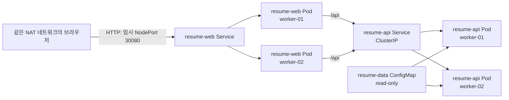
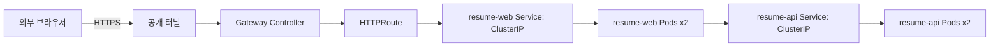

# Kubernetes 과제 제출 기록

기록일: 2026-09-20

이 문서는 실제로 구축·검증한 항목과 이후 보완 항목을 분리한다. 아직 수행하지 않은 결과를 성공한 것처럼 표현하지 않는다.

## 1. 실제 물리 구성

```text
Windows PC
└─ VMware Workstation / VMnet8 NAT (192.168.96.0/24)
   ├─ k8s-master-01  192.168.96.10  Control Plane + etcd
   ├─ k8s-worker-01  192.168.96.11  Application workload
   └─ k8s-worker-02  192.168.96.12  Application workload
```

모든 노드는 Ubuntu Server 24.04 LTS, containerd, Kubernetes v1.36.4로 구성했다. Calico v3.32.2는 Pod CIDR `10.244.0.0/16`, VXLAN 오버레이로 설치했다.

물리 PC와 단일 Control Plane은 단일 장애 지점이다. 따라서 이 환경은 Control Plane 고가용성(HA)을 제공한다고 주장하지 않는다.

## 2. 현재 검증 경로와 목표 논리 구성

### 현재 검증 경로



- Web과 API는 각각 2개 복제본이다.
- `topologySpreadConstraints`로 두 Worker에 분산을 선호하도록 구성했다.
- Web은 임시 NodePort `30080`으로 현재 동일 NAT 네트워크에서 접근 가능하다.
- API는 `ClusterIP`로 외부에 직접 노출하지 않는다.

### 최종 목표 경로



최종 구성에서는 Gateway Controller만 외부 진입을 담당하고, `resume-web`과 `resume-api`는 모두 `ClusterIP`로 유지한다. Gateway API·공개 HTTPS URL은 아직 구현하지 않았으며, 임시 NodePort는 Gateway 전환 후 제거한다.

## 3. 실제 검증 결과

### 노드와 CNI

- Control Plane 1대, Worker 2대가 `Ready` 상태로 확인됐다.
- Calico 설치 후 Pod 네트워크가 동작했고, Worker 간 테스트 Pod의 DNS·Service 통신을 확인했다.

### 서비스 복제본과 배치

2026-09-20에 확인한 배치 결과:

| 워크로드 | worker-01 | worker-02 |
|---|---:|---:|
| `resume-api` | 1 Pod | 1 Pod |
| `resume-web` | 1 Pod | 1 Pod |

두 Worker의 `http://192.168.96.11:30080`, `http://192.168.96.12:30080`에서 이력서 서비스 접속을 확인했다.

VM을 정상 종료 후 재기동한 뒤에도 모든 Pod가 `Running`, `1/1 Ready`로 복구됐다. 재기동 시점의 restart count 증가는 정상적인 VM 종료·시작에 따른 기록이다.

### ServiceAccount와 RBAC

`service-resume` ServiceAccount에 `resume` namespace 한정 `Role`을 바인딩했다.

- 허용: Pod, Service, Endpoint, Deployment, ReplicaSet의 `get`, `list`, `watch`
- 거부: `create`, `update`, `patch`, `delete`, Secret 조회, Node 조회
- Web/API Pod: `serviceAccountName: service-resume`
- Web/API Pod: `automountServiceAccountToken: false`

관리자 kubeconfig가 아니라 `system:serviceaccount:resume:service-resume`으로 impersonation하여 조회 허용과 변경·삭제 거부를 검증했다.

## 4. 트러블슈팅 사례: VM 복제 후 노드 식별·IP 중복 위험

| 항목 | 내용 |
|---|---|
| 상황 | Control Plane VM을 복제해 Worker를 만들었다. |
| 증상 | 복제본이 원본의 네트워크 식별 정보를 이어받아 DHCP 주소·노드 식별 충돌 위험이 발생했다. |
| 원인 | VM clone은 OS의 `machine-id`와 네트워크 설정까지 복제할 수 있다. MAC 주소만 다르더라도 DHCP 식별자(DUID)·호스트명이 남아 있으면 의도한 대로 식별되지 않을 수 있다. |
| 조치 | 각 VM의 hostname과 machine-id를 고유하게 설정하고, Netplan에서 고정 IP를 지정했다. |
| 결과 | master `.10`, worker-01 `.11`, worker-02 `.12`로 역할과 주소를 분리했고 SSH·노드 join·Pod 분산을 정상 확인했다. |
| 재발 방지 | VM 템플릿 생성 직후 hostname, machine-id, MAC, Netplan IP를 점검 항목으로 문서화한다. |

발표에서는 “Kubernetes 설치 이전에도 VM 복제 상태가 노드 식별과 네트워크에 영향을 준다. 그래서 kubeadm 사전 점검 항목인 hostname·MAC·product UUID·IP를 분리했다”라고 설명한다.

## 5. 발표용 캡처 목록

아래 순서대로 5장만 확보하면 핵심을 충분히 보여줄 수 있다.

| 순서 | 명령 또는 화면 | 증명 내용 |
|---:|---|---|
| 1 | `k get no -o wide` | Control Plane 1 + Worker 2, Ready 상태 |
| 2 | `k -n resume get pods -o wide` | Web/API 복제본 2개 및 Worker 분산 |
| 3 | 브라우저의 이력서 화면 | 임시 NodePort를 통한 앱 동작 확인 |
| 4 | `k auth can-i ... --as=system:serviceaccount:resume:service-resume` | 조회 허용, 변경·삭제 거부 |
| 5 | `k -n resume get sa,role,rolebinding` | service-resume과 RoleBinding 구성 |

## 6. 3분 발표 흐름

1. VMware Workstation의 3노드 kubeadm 클러스터와 선택 이유를 설명한다.
2. containerd + Calico VXLAN을 선택한 이유를 설명한다. 상위 VMware NAT 네트워크에 Pod CIDR 라우팅을 추가할 수 없으므로 VXLAN을 선택했다.
3. Web/API 2계층 구조와 복제본 분산을 설명하고, 현재 NodePort는 Gateway 전환 전 검증 경로임을 명시한다.
4. `service-resume` 읽기 전용 RBAC과 토큰 자동 주입 차단을 설명한다.
5. VM 복제 뒤 고정 IP·machine-id를 정리한 트러블슈팅 사례와 단일 PC·단일 Control Plane 한계를 설명한다.

## 7. 남은 작업

- Gateway API Controller와 `Gateway`·`HTTPRoute`를 설치한다.
- `resume-web` Service를 ClusterIP로 변경하고 임시 NodePort를 제거한다.
- 공개 터널을 Gateway 진입점에 연결해 외부 HTTPS URL을 구성하고, URL·검증 결과를 이 문서에 추가한다.
- NetworkPolicy는 적용돼 있지만, 허용·차단 통신을 별도로 실증하는 테스트는 아직 기록하지 않았다.
